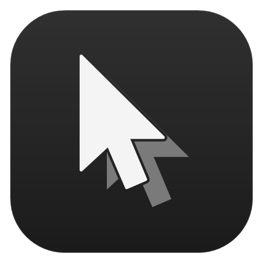
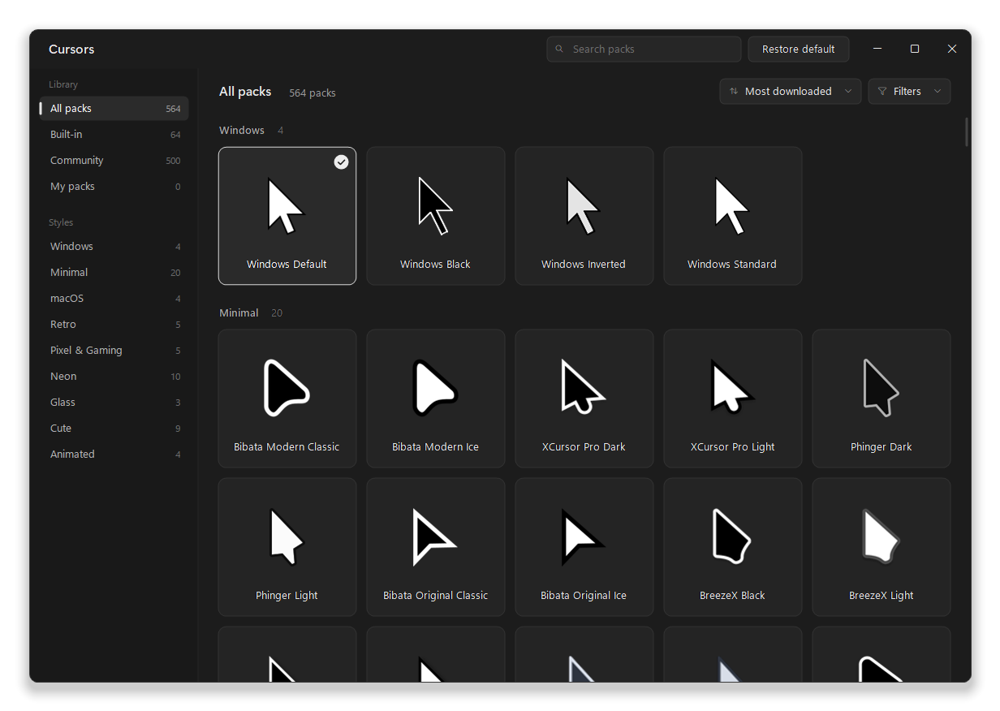
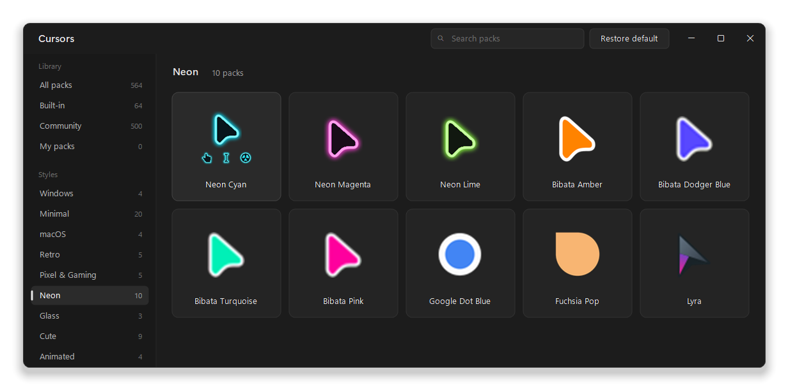
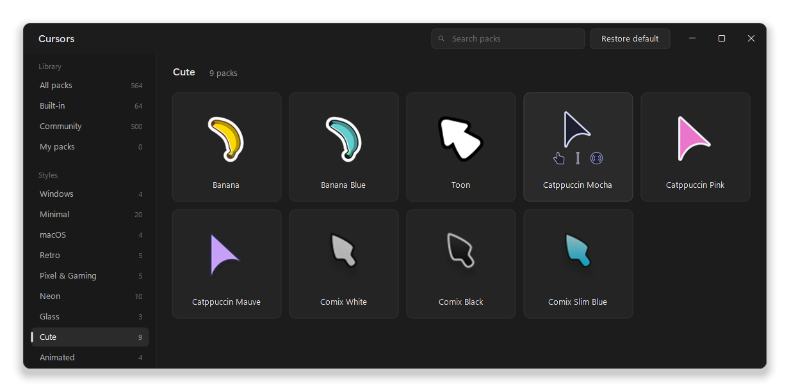
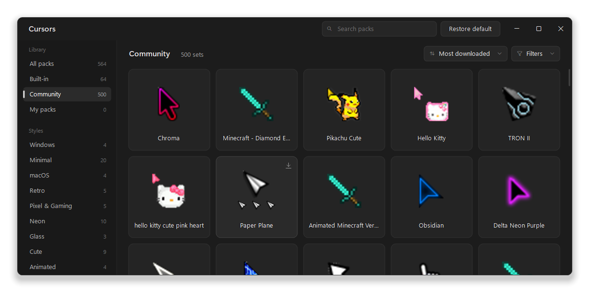

<div align="center">



# Cursors

**One-click cursor packs for Windows**

A small, native app with 60 built-in cursor styles and 500 popular community cursor sets. Click a card and your whole pointer scheme changes instantly.

[](https://github.com/rohzzn/cursors/releases/latest)


[](LICENSE)

<br>



</div>

## Highlights

- **One click, the whole scheme.** Every card sets all 17 cursor types Windows defines: normal, link, text, busy, working, the four resizes, move, unavailable, precision, help, handwriting, alternate, location and person.
- **60 packs out of the box.** Minimal, macOS-style, retro, pixel and gaming, neon, glass, cute and animated styles, each with credits and a license.
- **500 community sets.** The most-downloaded complete sets from [rw-designer.com](https://www.rw-designer.com/cursor-library) are in the **Community** section, including 23 Minecraft sets and RuneScape, Mario, Zelda, Sonic and Undertale ones. Previews load as you scroll, and one click downloads and applies a set.
- **Previews.** Large previews of every pack, with animated cursors playing and each pack's link, text and busy cursors fading in when you hover.
- **Search.** Start typing to find a pack by name, style or author.
- **Browse, sort and filter.** A sidebar takes you to all packs, the built-in ones, Community, your own packs or a single style. Community sets sort by downloads, rating or name, and filter to full sets, animated sets, top-rated sets or open licenses.
- **Your own packs.** Drop a `.zip`, an `install.inf` or loose `.cur`/`.ani` files onto the window. Roles are detected automatically, including from `install.inf` files that list them out of order.
- **Import from a link.** Paste or drag in a link to a cursor set page, such as one on [rw-designer.com](https://www.rw-designer.com/cursor-library), and Cursors downloads that set into your library with its name, license and source.
- **Stays applied.** Your choice survives restarts using the same settings as Mouse Properties. No startup entry, no background process.
- **Light and native.** A single 184 KB exe that opens in well under a second and uses no CPU while idle. It has a dark title bar with Windows 11 snap layouts and handles per-monitor DPI.
- **Private.** No account and no telemetry. Cursors only goes online to show Community previews and to download a set or link you pick.

## Download

1. Download the **`Cursors-<version>-windows.zip`** file from the [latest release](https://github.com/rohzzn/cursors/releases/latest).
2. Extract it anywhere, keeping `Cursors.exe` and the `Packs` folder together.
3. Run **`Cursors.exe`**. There's nothing to install, and admin rights aren't needed. The first launch adds Cursors to the Start menu and the desktop, so you can find it in Windows search.

**If you see "Windows protected your PC":** the app isn't code-signed yet, so SmartScreen may warn on first launch. Choose **More info → Run anyway**. Each release lists the zip's SHA-256 so you can check your download.

**Requirements:** Windows 10 or 11 with .NET Framework 4.8, which is built into Windows 10 (version 1903 and later) and Windows 11. Cursors was developed and tested on Windows 11.

## Screenshots

<table>
  <tr>
    <td></td>
    <td></td>
  </tr>
  <tr>
    <td align="center"><sub>Hover a card to see more of the pack</sub></td>
    <td align="center"><sub>Browse the built-in styles from the sidebar</sub></td>
  </tr>
</table>

<p align="center"><br><sub>500 community sets, with sort, filters and previews that load as you scroll</sub></p>

## The library

| Category | Packs |
| --- | --- |
| **Windows** | The styles built into Windows: Default, Black, Inverted, Standard |
| **Minimal** (20) | Bibata Modern and Original (Classic, Ice), XCursor Pro Dark and Light, Phinger Dark and Light, BreezeX Black and Light, Notwaita Black and White, Nordzy, Nordzy White, Android, Modern Inverted, Vimix, Fuchsia, Google Dot Black and White |
| **macOS** (4) | macOS, macOS White, WhiteSur, Capitaine |
| **Retro** (5) | Hackneyed, Hackneyed Dark, Retrosmart Win, Retrosmart Mac, Retrosmart Terminal |
| **Pixel & Gaming** (5) | Pixel, Adventure, Sci-Fi, Future, XCursor Pro Red |
| **Neon** (10) | Neon Cyan, Neon Magenta, Neon Lime, Bibata Amber, Bibata Dodger Blue, Bibata Turquoise, Bibata Pink, Google Dot Blue, Fuchsia Pop, Lyra |
| **Glass** (3) | Ghost, Spirit, Tinted Glass |
| **Cute** (9) | Banana, Banana Blue, Toon, Catppuccin Mocha, Pink and Mauve, Comix White, Black and Slim Blue |
| **Animated** (4) | Rainbow Modern, Rainbow Original, Bee, Zebra |

Every pack was checked before it was included:

- **Parsing:** every file is parsed and decoded.
- **Loading:** Windows' own `LoadCursorFromFile` loads each file.
- **Hotspots:** each hotspot lies inside its image.
- **Blank images:** no image is empty.
- **Contact sheets:** a sheet of every role was reviewed by eye.
- **Real apply:** each pack was applied for real, confirming Windows loaded all 17 cursors.

Packs with unclear licensing, such as Figma, Minecraft and other game or brand cursors, were left out of the bundled library on purpose. Popular fan-made game sets are in the [Community](#community-sets) section instead, downloaded from rw-designer.com when you pick one.

## Using Cursors

| To… | Do this |
| --- | --- |
| Apply a pack | Click its card, or use the arrow keys and <kbd>Enter</kbd> |
| See more of a pack | Hover its card |
| Find a pack | Start typing, or press <kbd>Ctrl</kbd>+<kbd>F</kbd>. <kbd>Esc</kbd> clears the search, and <kbd>Enter</kbd> or <kbd>↓</kbd> jumps to the results |
| Browse a view or style | Pick it in the sidebar, or press <kbd>Ctrl</kbd>+<kbd>Tab</kbd> to step through them |
| Sort or filter community sets | Use **Sort** and **Filters** at the top of All packs or Community |
| Get a community set | Open **Community** and click a card. The set downloads, applies and stays in your library |
| Go back to the Windows cursors | Click **Restore default** in the title bar |
| Add your own packs | Use **Add pack → From files…** or <kbd>Ctrl</kbd>+<kbd>O</kbd>, or drag folders and zips onto the window |
| Add a pack from a link | Use **Add pack → From a link…** or <kbd>Ctrl</kbd>+<kbd>L</kbd>, press <kbd>Ctrl</kbd>+<kbd>V</kbd> with a link copied, or drag a link from your browser onto the window |
| See credits, the project page or files | Right-click a card |
| Remove a pack you added | Right-click it and choose **Remove from library** |
| Rescan the library | <kbd>F5</kbd> |
| Restore defaults without the window | Run `Cursors.exe --restore` |

## Community sets

The **Community** section lists the 500 most-downloaded cursor sets on [rw-designer.com](https://www.rw-designer.com/cursor-library) that work as a scheme: each downloads as one file, has a normal pointer and covers at least three cursor roles. Sets the site marks as adult content, and sets with explicit or hateful words in their names, are left out.

- **Nothing is bundled.** The app ships only the list, [`packs/catalog.tsv`](packs/catalog.tsv): names, authors, download counts, licenses and links.
- **Previews load as you scroll.** Each card's preview image comes from rw-designer.com when the card scrolls into view, a couple at a time, and is cached in `%LOCALAPPDATA%\Cursors\Catalog`.
- **Sort and filter.** Sort by **Most downloaded**, **Top rated** or **Name**. **Filters** narrows the list to full sets (all 15 cursors), animated sets, sets the site rates highly, or public-domain and CC BY licenses. The header shows how many sets match.
- **One click to apply.** Clicking a card downloads that set, maps each file to the role the site tags it with, adds it to your library and applies it. Afterwards the card works offline like any other pack.
- **Licenses come from the authors.** Right-click a card to see its author, license and download count, or to open its page.

The list is refreshed with `tools\update-catalog.ps1`; see [Building from source](#building-from-source).

## Importing from a link

Found a set you like on a cursor site? Copy the link to its page and press <kbd>Ctrl</kbd>+<kbd>L</kbd> in Cursors, or drag the link from your browser onto the window.

| Link | What Cursors does |
| --- | --- |
| A set page on rw-designer.com, like `https://www.rw-designer.com/cursor-set/…` | Reads the page once for the set's name, license and download, then downloads the set |
| A single cursor page on rw-designer.com | Downloads that one cursor |
| A direct link to a `.zip`, `.cur` or `.ani` file | Downloads the file |

Only the link you give it is downloaded, and nothing is uploaded. Downloads are limited to 50 MB. The set is copied into your library under **Added**, and roles are detected from its file names such as `Diamond Sword - Normal Select.cur`. Right-click it to see the author, license and source page.

Imported sets stay on your PC and are never added to this project. Each set's license is chosen by the person who uploaded it, so check it before you share or reuse the files.

## How it works

- **Applying.** Cursors writes the scheme to `HKCU\Control Panel\Cursors` and asks Windows to reload it with `SystemParametersInfo(SPI_SETCURSORS)`, the same mechanism Mouse Properties uses. Windows reads those values again at sign-in, so nothing needs to keep running.
- **Installing.** A pack's files are copied to `%LOCALAPPDATA%\Cursors` the first time it's applied, so your cursor keeps working if you move or delete the app.
- **Undo.** On first launch, Cursors saves your existing cursor setup. If that setup isn't one of the packs, it appears under **Added** so you can get it back.

**Where it writes:** `HKCU\Control Panel\Cursors`, `%LOCALAPPDATA%\Cursors` (settings, installed packs, packs you add and cached Community previews), and a Cursors shortcut in the Start menu and on the desktop.

## Uninstall

1. Run `Cursors.exe --uninstall`. It puts back the Windows cursors and removes the Start menu and desktop shortcuts.
2. Delete the folder you extracted.
3. Optionally, delete `%LOCALAPPDATA%\Cursors`.

## FAQ

<details>
<summary><b>Does Cursors run in the background?</b></summary>

No. It only runs while its window is open. The cursor you pick stays applied after you close it.
</details>

<details>
<summary><b>Can I use cursor packs I downloaded elsewhere?</b></summary>

Yes. Drag the `.zip`, the `install.inf` or the `.cur`/`.ani` files onto the window. Cursors copies them into its library and works out which cursor is which. You can also skip the download and [import straight from a link](#importing-from-a-link).
</details>

<details>
<summary><b>Is there a Minecraft pack?</b></summary>

Yes. **Community** has 23 Minecraft sets, from Minecraft - Diamond Edition down, plus RuneScape, Mario, Zelda, Sonic and Undertale sets. They aren't bundled, because game cursors aren't published under licenses that allow redistribution, so each one downloads from rw-designer.com when you click it. For a set from anywhere else, [import it from a link](#importing-from-a-link).
</details>

<details>
<summary><b>Where do the Neon packs come from?</b></summary>

No openly licensed neon set exists, so these three are made from Bibata Modern Classic (GPL-3.0) by recoloring the outline and adding a glow. The conversion is part of this repository's pack tooling.
</details>

## Building from source

This needs the Roslyn C# compiler, which comes with Visual Studio or the free *Build Tools for Visual Studio*.

```bash
powershell -ExecutionPolicy Bypass -File build.ps1
```

This produces `bin\Cursors.exe`, with `bin\Packs` linked to `packs\`. Add `-Package` to also create `dist\Cursors-<version>-windows.zip` and its SHA-256. `Cursors.csproj` is included for Visual Studio, Rider or `dotnet build`, but it is untested; `build.ps1` is the verified build.

<details>
<summary><b>Rebuilding the cursor library from upstream</b></summary>

Download every upstream source into a folder. Each download is checked against a pinned hash or commit:

```bash
powershell -ExecutionPolicy Bypass -File tools\fetch-pack-sources.ps1 -Destination D:\cursor-sources
```

Convert, verify and publish the library to `packs\`:

```bash
powershell -ExecutionPolicy Bypass -File tools\build-packs.ps1 -Sources D:\cursor-sources -ApplyTest
```

`-ApplyTest` applies every pack for real and restores your cursors afterwards. A fresh rebuild reproduces the published library byte for byte. The sources are listed in [`tools/SOURCES.md`](tools/SOURCES.md), and every pack is described in [`tools/packs.recipe`](tools/packs.recipe).
</details>

<details>
<summary><b>Refreshing the Community list</b></summary>

```bash
powershell -ExecutionPolicy Bypass -File tools\update-catalog.ps1
```

This rewrites `packs\catalog.tsv`. The script reads only rw-designer's public listing and set pages, which its `robots.txt` allows, at one request per second. It downloads no cursor files. Pages are cached for three days, so a stopped run resumes. A full refresh reads about 11,900 pages, a little over three hours. `-Count` limits the list to the most-downloaded sets, and `-MinRoles` to sets covering that many cursor roles.
</details>

<details>
<summary><b>Project layout</b></summary>

```
src/                    the app (C#, WinForms, custom-drawn)
  Program.cs              entry point, single instance, --restore
  MainWindow*.cs          state, drawing, input, custom title bar
  CursorScheme.cs         applying schemes and detecting the active one
  PackLibrary.cs          Windows, bundled and added packs; import and install
  PackDetection.cs        install.inf parsing and file-name role detection
  LinkImport.cs           importing a pack from a set page or file link
  Catalog.cs              the Community list and its cached preview images
  Shortcuts.cs            Start menu and desktop shortcuts
  CursorImage.cs          .cur/.ani decoder for previews
packs/                  the bundled library, NOTICE.md and LICENSES/
tools/                  pack recipe, source fetcher, library builder, PackTool, logo generator
docs/                   logo and screenshots
build.ps1               builds and packages the app
```
</details>

## Contributing

Issues and pull requests are welcome. To suggest a cursor pack, link its source and confirm its license allows redistribution. To add one yourself, describe it in `tools/packs.recipe` and run `tools\build-packs.ps1` with `-ApplyTest`.

## Credits

The bundled cursors are the work of their authors:

- **Individual designers:** Kaiz Khatri (Bibata, macOS, XCursor Pro, BreezeX, Banana, Fuchsia, Google Dot and more), Philipp Schaffrath (Phinger), Guillaume Boehm (Nordzy), Vince Liuice (Vimix, WhiteSur), Keefer Rourke (Capitaine), yeyushengfan258 (Future, Lyra), Richard Ferreira (Hackneyed), Manuel Domínguez López (Retrosmart), silica-dev (translucent Bibata), emvaized (Modern Inverted), donut2 (Notwaita), and Jens Luetkens and Ben Finney (ComixCursors)
- **Projects:** Catppuccin, the Android Open Source Project, and [Kenney](https://kenney.nl)

Full attribution for each pack is in [`packs/NOTICE.md`](packs/NOTICE.md).

## License

The source code and documentation for Cursors are released under the [MIT License](LICENSE), © 2026 Rohan.

The cursor packs in `packs/` are separate works, distributed under their own licenses: GPL-3.0, GPL-2.0, LGPL-3.0, CC BY-SA, Apache-2.0, MIT, X11 and CC0. See [`packs/NOTICE.md`](packs/NOTICE.md) and [`packs/LICENSES/`](packs/LICENSES).

Community sets aren't part of this repository. `packs/catalog.tsv` only lists their names and links. Each set is hosted on rw-designer.com and licensed by its author, as shown on its page.
